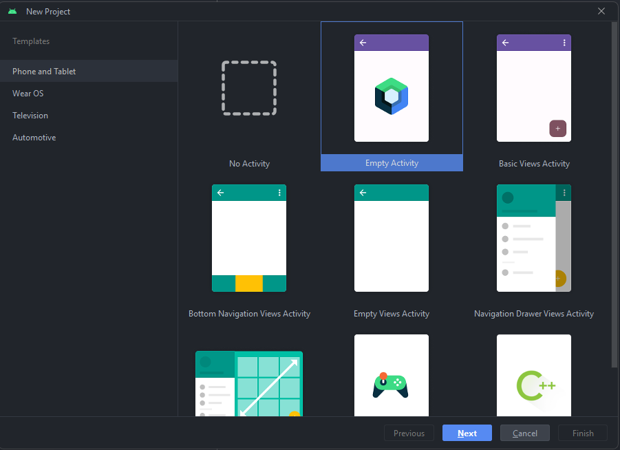
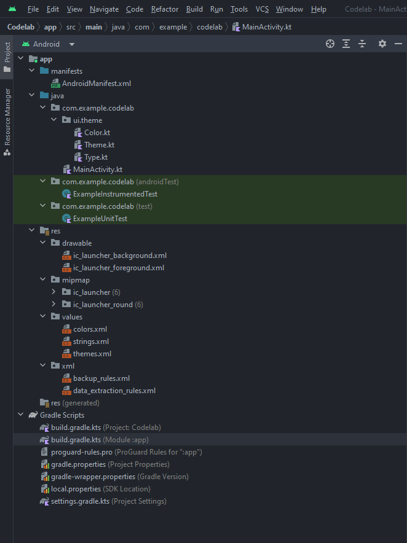
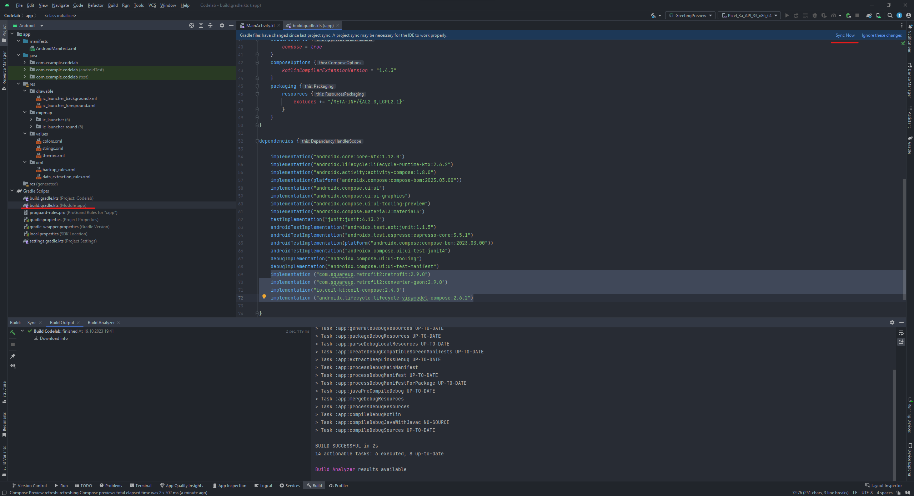
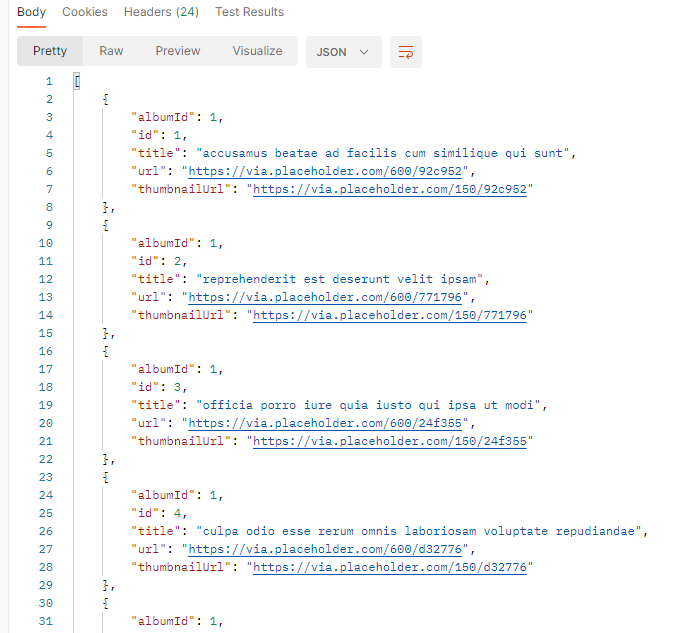
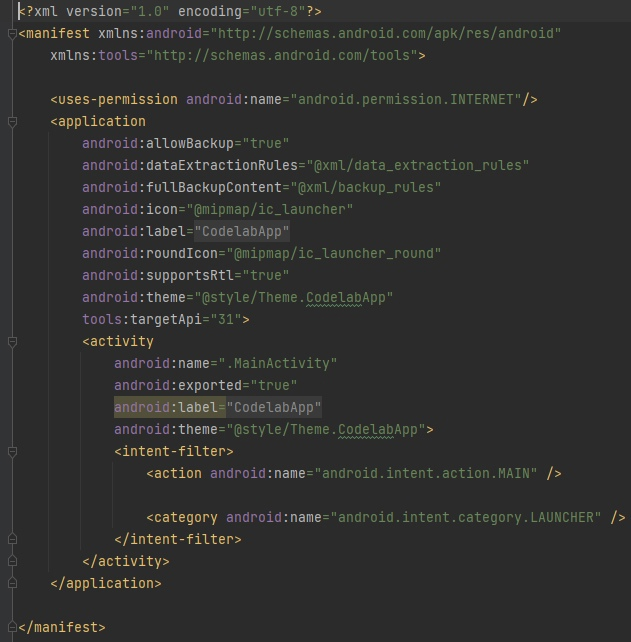
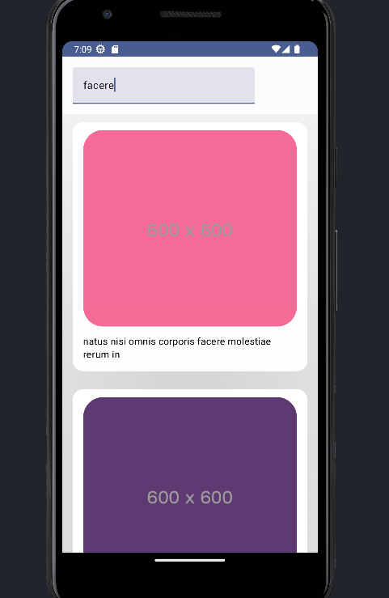

# Методические указания по выполнению задания для платформы Android

## План

1. [Создание проекта](#создание-проекта)
2. [Структура проекта](#структура-проекта)
3. [Добавление зависимостей](#добавление-зависимостей)
4. [Создание модели](#создание-модели)
5. [Создание API](#создание-api)
6. [Добавление разрешения](#добавление-разрешения)
7. [Создание Data Layer](#создание-data-layer)
8. [Создание ViewModel](#создание-viewmodel)
9. [Создание UI](#создание-ui)
10. [Итог](#итог)

## Создание проекта

Создаем новый проект в [Android Studio](https://developer.android.com/studio). В качестве шаблона выбираем `Empty Activity`.



Далее выбираем имя для проекта и нажимаем на кнопку **_finish_**


Затем необходимо некоторое время подождать, когда все необходимые файлы для работы приложения будут созданы, а все
необходимые зависимости будут загружены.

## Структура проекта



Проект для `Android` имеет следующую структуру:

- Папка `manifests`
- Папка `java`
- Папка `res`
- `Gradle Scripts`

В папке `manifests` описываются файлы-манифесты, они декларируют особенности Android приложения.

В этих файлах описываются
**основные компоненты**, которые будут использованы в приложении (всего их
4 - `Activity`, `Service`, `BroadcastReceiver`, `ContentProvider`),
запрашиваемые приложением **разрешения** (например, доступ в Интернет),
а также некоторые другие особенности работы приложения.

Манифест может быть _только один_ для конкретной сборки.
> **Важно**
>
> Некоторые, потенциально опасные разрешения, можно получить, только в процессе работы приложения, они
> называются `Runtime Permissions`
>

В папке `Java`, находятся 3 пакета, два из них предназначены для тестирования приложения, а в третьем будет описано само
**приложение**,
логика его работы, а также пользовательский интерфейс.

В папке `res`, находятся различные **статические** файлы - текст для компонентов, изображения, шрифты, вёрстка статичных
компонентов
(актуально для приложений на `view`).

`Gradle Scripts` - данная секция предназначена для работы _системы автоматической сборки_ `Gradle`.

Здесь мы можем описывать какие нам необходимы **зависимости** для нашего приложения, и в частности для нашего модуля,
это позволяет построить многомодульное приложение, с конкретными разделениями зависимостей для работы каждого модуля.

## Добавление зависимостей

Добавим в файл `build.gradle.kts(:app)` следующие зависимости:

```kotlin 
implementation ("com.squareup.retrofit2:retrofit:2.9.0")
implementation ("com.squareup.retrofit2:converter-gson:2.9.0")
implementation("io.coil-kt:coil-compose:2.4.0")
implementation ("androidx.lifecycle:lifecycle-viewmodel-compose:2.6.2")
```



Нажмём кнопку `Sync Now`, чтобы загрузить добавленные зависимости.

`Retrofit` это type-safe **HTTP клиент** для Android, который используется для получения, обновления и удаления данных
из веб-сервисов.
Он упрощает использование `REST API` в приложении `Android`.

Вторая зависимость `implementation ("com.squareup.retrofit2:converter-gson:2.9.0")` - позволяет нам на лету,
конвертировать
`json` ответ от веб-сервиса в `Kotlin Data Class`.

`Coil` - это библиотека, позволяющая загружать и отображать изображения по `url`, используется кеширование изображений

`ViewModel` - это компонент приложения, который необходим, чтобы **хранить** `state`(состояние(я)) приложения для
последующего
его отображения на экране приложения. Он требуется, чтобы сохранять различные состояния, независимо от жизненного цикла
основных компонентов приложения.

Яркий пример - когда приложение сворачивается, но не закрывается, данные во `ViewModel`
сохраняются, несмотря на то, что все элементы UI закрыты и очищены. Ещё один пример - переворот экрана.

## Создание модели

Перед тем как получать данные от веб-сервиса, необходимо создать модель, в которую эти данные будут загружаться.
Модель будет представлена в `Kotlin` в виде `Data Class`

> **Data Class**
>
> Data Class - это класс, главная цель которого хранить данные. Он обладает некоторыми автоматически сгенерированными
> функциями, позволяющими сравнивать, копировать и проверять уникальность каждой конкретной реализации этого класса.
>

Названия полей в модели должны помечаться с помощью аннотации

```kotlin 
@SerializedName(field_name)
```

`field_name` - это название соответствующего поля в формате `json` ответа от веб-сервиса.

Формат `json` ответа от веб-сервиса:



Создаем `data class` в пакете `model` директории `com.example.codelab`.

```kotlin
// Добавляем необходимые импорты, используя `Alt + Enter`.
import com.google.gson.annotations.SerializedName

// Класс `Photo` представляет собой модель данных для фотографий и содержит поля,
// соответствующие полям в JSON-структуре.

data class Photo(
    @SerializedName("albumId")
    val albumId: Int,
    @SerializedName("id")
    val id: Int,
    @SerializedName("title")
    val title: String,
    @SerializedName("url")
    val url: String,
    @SerializedName("thumbnailUrl")
    val thumbnailUrl: String
)
```


## Создание API

В директории `com.example.codelab` создадим пакет `network`. В пакете `network` создадим interface `CodelabApi`.

> **Java/Kotlin Interface**
>
>  Interface используется, когда мы хотим обозначать некоторый контракт, который должны выполнять классы, которые
> следуют этому интерфейсу (имплементируют (реализуют) этот интерфейс). В Java и Kotlin, это структуры, описывающие набор
> функций, их входные и выходные параметры, но не реализацию.
> Фактически Interface представляет собой внутрипрограммное API,
> которому следуют реализующее его классы (таких классов может быть несколько).
>

```kotlin 
interface CodelabApi {

    @GET("photos")
    suspend fun getAllPhotos(): List<Photo>

    companion object RetrofitBuilder{
        private const val BASE_URL = "https://jsonplaceholder.typicode.com/"

        private fun getRetrofit(): Retrofit {
            return Retrofit.Builder()
                .baseUrl(BASE_URL)
                .addConverterFactory(GsonConverterFactory.create())
                .build()
        }
        val api: CodelabApi = getRetrofit().create()
    }

}
```

Опишем GET-запрос `getAllPhotos()`, который вернёт нам список фотографий с сервера, в виде json ответа,
и автоматически десериализуется в список фотографий в котлине List<Photos>.

**Сompanion object** `RetrofitBuilder`, необходим для того, чтобы создать http-клиент, который будет выполнять наш зарос (или запросы).


## Добавление разрешения

Для того чтобы наше приложение смогло успешно выполнять запросы в Internet с помощью API, необходимо добавить
соответствующее разрешение в файл `AndroidManifest.xml` в директории `manifests`.

```xml
<uses-permission android:name="android.permission.INTERNET"/>
```




## Создание Data Layer

В директории `com.example.codelab` создадим пакет `domain`. В пакете `domain` создадим interface `PhotoRepository` и
class `PhotoRepositoryImpl` реализующий его.

Репозиторий (_**интерфейс**_) описывает набор методов для получения данных в заранее определённом формате.
Он необходим для того, чтобы **унифицировать** методы доступа к данным для различных видов хранилищ (локального и удалённого)

```kotlin 
interface PhotoRepository {
    fun getAllPhotos(): Flow<List<Photo>>
}
```

```kotlin 
class PhotoRepositoryImpl() : PhotoRepository {
    override fun getAllPhotos(): Flow<List<Photo>> =
        callbackFlow {
            trySendBlocking(
                CodelabApi.api.getAllPhotos()
            )
            awaitClose()
        }
}

```

Так как Репозиторий это _**интерфейс**_, то чтобы его использовать необходимо создать его реализацию.
Поэтому создаём класс `PhotoRepositoryImpl`, который реализует методы нашего репозитория.

## Создание ViewModel

В директории `com.example.codelab` создадим пакет `vm`. В пакете `vm` создадим class `PhotoViewModel`.

> **ViewModel**
>
> Класс ViewModel предназначен для хранения и управления данными, связанными с пользовательским интерфейсом, с учетом жизненного цикла. 
> С его помощью возможно сохранять данные при изменении конфигурации, такой, как поворот экрана.
```kotlin 
class PhotoViewModel (private val photoRepository: PhotoRepositoryImpl = PhotoRepositoryImpl()) : ViewModel() {
    private val _photoUiState = MutableStateFlow(emptyList<Photo>())
    val photoUiState = _photoUiState.asStateFlow()

    fun getAllPhotos() {
        viewModelScope.launch(CoroutineExceptionHandler{ _, exception ->
            println("CoroutineExceptionHandler got $exception") }) {
            photoRepository.getAllPhotos()
                .collect { photos ->
                    _photoUiState.value = photos
                }
        }
    }
}
```

Наша `ViewModel` хранит в себе `StateFlow`(поток состояний), в котором содержится список фотографий.
Это значит, что в случае, если добавиться новое значение, объекты или переменные, которые "подписаны" на этот `Flow`, получат уведомление.
Подробнее, смотрите [Kotlin Flow](https://kotlinlang.org/api/kotlinx.coroutines/kotlinx-coroutines-core/kotlinx.coroutines.flow/-flow/).

## Создание UI

В файле MainActivity создадим `@Composable` функции, отвечающие за UI

В нашей функции используются другие `@Composable` различные функции.

- `BackHandler` позволяет описывать те функции, которые должны сработать при нажатии на системную кнопку назад или аналогичный жест.
- `Column` позволяет организовывать элементы друг за другом вертикально.
- `AsyncImage` позволяет асинхронно загрузить и отобразить картинку согласно представленной ссылке.
- `Text` позволяет отобразить текст, с которым нельзя (как правило) взаимодействовать
- `OutlinedTextField` - это текстовое поле, с функцией ввода значений
- `LazyColumn` - аналогично `Column`, но позволяет держать в оперативной памяти только ограниченное количество элементов, что увеличивает производительность, когда суммарное количество одинаковых(представлений) элементов превышает 10/100/1000/10000 элементов
- `LaunchedEffect` - позволяет запускать функции, которые будут не привязаны к обновлениям экрана и компонента, в котором описаны. Они будут выполнены в некотором `CoroutineScope`

Подробнее про [Kotlin Coroutines](https://kotlinlang.org/docs/coroutines-basics.html#your-first-coroutine).


```Kotlin
@Composable
fun PhotoCard(
    photo: Photo,
    modifier: Modifier = Modifier,
    backHandle: () -> Unit = {},
    isFull: Boolean = false
) {
    BackHandler {
        backHandle()
    }
    Column(
        verticalArrangement = Arrangement.spacedBy(0.dp, Alignment.Top),
        horizontalAlignment = Alignment.CenterHorizontally,
        modifier = modifier
            .padding(top = 12.dp)
            .fillMaxWidth()
            .wrapContentHeight()
            .shadow(
                elevation = 200.dp,
                ambientColor = Color(0x14000000)
            )
            .padding(start = 16.dp, end = 16.dp, bottom = 16.dp)
            .background(color = Color(0xFFFFFFFF), shape = RoundedCornerShape(size = 16.dp))
    ) {
        AsyncImage(
            model = photo.url,
            contentDescription = "image description",
            contentScale = ContentScale.FillBounds,
            modifier = Modifier
                .padding(top = 12.dp)
                .width(328.dp)
                .height(301.dp)
                .clip(RoundedCornerShape(30.dp))
        )
        Text(
            text = photo.title,
            style = TextStyle(
                fontSize = 15.sp,
                lineHeight = 20.sp,
                fontWeight = FontWeight(400),
                color = Color(0xFF000000),
                letterSpacing = 0.2.sp,
            ),
            modifier = Modifier.padding(start = 16.dp, top = 12.dp, end = 16.dp, bottom = 16.dp)
        )
        if (isFull) {
            Text(
                text = "id = ${photo.id}",
                style = TextStyle(
                    fontSize = 11.sp,
                    lineHeight = 14.sp,
                    fontWeight = FontWeight(600),
                    color = Color(0xFF818C99),
                    letterSpacing = 0.3.sp,
                ),
            )
            Text(
                text = "albumId = ${photo.albumId}",
                style = TextStyle(
                    fontSize = 11.sp,
                    lineHeight = 14.sp,
                    fontWeight = FontWeight(600),
                    color = Color(0xFF818C99),
                    letterSpacing = 0.3.sp,
                ),
            )
        }
    }
}
```

```Kotlin
@OptIn(ExperimentalMaterial3Api::class)
@Composable
@Preview
fun PhotoScreen(modifier: Modifier = Modifier.fillMaxSize(1f)) {
    var selected by remember {
        mutableStateOf(-1)
    }
    val scope = rememberCoroutineScope()
    val viewModel: PhotoViewModel = viewModel()
    LaunchedEffect(Unit) {
        scope.launch {
            viewModel.getAllPhotos()
        }
    }

    val photos by viewModel.photoUiState.collectAsState()
    var filteredPhotos by remember {
        mutableStateOf(photos)
    }
    var filterText by remember {
        mutableStateOf("")
    }
    if (selected != -1) {
        photos.find { it.id == selected }
            ?.let {
                PhotoCard(
                    photo = it,
                    backHandle = { selected = -1 },
                    isFull = true
                )
            }
    } else {
        Column {

            //Добавляем поле для ввода
            OutlinedTextField(
                value = filterText,
                textStyle = TextStyle(
                    fontSize = 16.sp,
                    lineHeight = 20.sp,
                    fontWeight = FontWeight(400),
                    color = Color(0xFF818C99),
                    letterSpacing = 0.1.sp,

                    ),
                //При изменении состояния поля (ввод символов), ищем карточки
                onValueChange = {
                    filterText = it
                    scope.launch {
                        filteredPhotos = photos.filter { photo ->
                            photo.title.contains(filterText)
                                    || photo.id.toString()
                                .contains(filterText) || photo.albumId.toString()
                                .contains(filterText)
                        }
                    }
                },
                modifier = Modifier
                    .padding(16.dp)
                    .fillMaxWidth()
                    .background(color = Color(0xFFF2F3F5), shape = RoundedCornerShape(size = 8.dp))
            )

            //Добавим заглушку, если не нашли нужную карточку
            LazyColumn {
                items(filteredPhotos.ifEmpty {
                    if (filterText.isEmpty()) photos else listOf(
                        Photo(
                            -1,
                            -1,
                            "Ничего не найдено",
                            thumbnailUrl = "https://www.iguides.ru/upload/iblock/63f/63f70bc560efa08dd3db6bf81e72ea61.jpg",
                            url = "https://www.iguides.ru/upload/iblock/63f/63f70bc560efa08dd3db6bf81e72ea61.jpg"
                        )
                    )
                }) {
                    PhotoCard(photo = it, Modifier.clickable { selected = it.id })
                }
            }
        }
    }
}
```

Добавим в MainActivity в функцию setContent нашу composable-функцию PhotoScreen отвечающую за UI

```Kotlin
class MainActivity : ComponentActivity() {
    @OptIn(ExperimentalMaterial3Api::class)
    override fun onCreate(savedInstanceState: Bundle?) {
        super.onCreate(savedInstanceState)
        setContent {
            CodelabAppTheme {
                Surface(
                    modifier = Modifier.fillMaxSize(),
                    color = MaterialTheme.colorScheme.background
                ) {
                    PhotoScreen()
                }
            }
        }
    }
}
```
## Итог




<seealso>
<!--Give some related links to how-to articles-->
</seealso>
