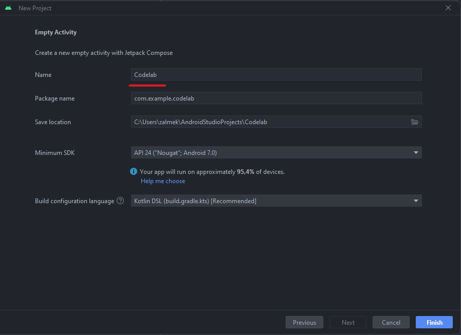

# CodelabApp
# Методические указания по выполнению задания для платформы Android

## План

1. Создание проекта
2. Структура проекта
3. Добавление зависимостей
4. Создание модели
5. Создание API

## Создание проекта

Создаем новый проект в `Android Studio`. В качестве шаблона выбираем `Empty Activity`.


Далее выбираем имя для проекта и нажимае на кнопку **_finish_**



Затем необходимо некоторое время подождать, когда все необходимые файлы для работы приложения будут созданы, а все
необход
имые зависимости будут загружены.

## Структура проекта


Проект для `Android` имеет следующую структуру:

- Папка `manifests`
- Папка `java`
- Папка `res`
- `Gradle Scripts`

В папке `manifests` описываются файлы-манифесты, они декларируют особенности Android приложения.

В этих файлах описываются
**основные компоненты**, которые будут использованы в приложении (всего их
4 - `Activity`, `Service`, `BroadcastReceiver`, `ContentProvider`),
запрашиваемые приложением **разрешения** (например, доступ в Интернет),
а также некоторые другие особенности работы приложения.

Манифест может быть _только один_ для конкретной сборки.
> **Важно**
>
> Некоторые, потенциально опасные разрешения, можно получить, только в процессе работы приложения, они
> называются `Runtime Permissions`
>
{style="warning"}

В папке `Java`, находятся 3 пакета, два из них предназначены для тестирования приложения, а в третьем будет описано само
**приложение**,
логика его работы, а также пользовательский интерфейс.

В папке `res`, находятся различные **статические** файлы - текст для компонентов, изображения, шрифты, вёрстка статичных
компонентов
(актуально для приложений на `view`).

`Gradle Scripts` - данная секция предназначена для работы _системы автоматической сборки_ `Gradle`.

Здесь мы можем описывать какие нам необходимы **зависимости** для нашего приложения, и в частности для нашего модуля,
это позволяет построить многомодульное приложение, с конкретными разделениями зависимостей для работы каждого модуля.

## Добавление зависимостей

Добавим в файл `build.gradle.kts(:app)` следующие зависимости:

```kotlin 
implementation ("com.squareup.retrofit2:retrofit:2.9.0")
implementation ("com.squareup.retrofit2:converter-gson:2.9.0")
implementation("io.coil-kt:coil-compose:2.4.0")
implementation ("androidx.lifecycle:lifecycle-viewmodel-compose:2.6.2")
```


Нажмём кнопку `Sync Now`, чтобы загрузить добавленные зависимости.

`Retrofit` это type-safe **HTTP клиент** для Android, который используется для получения, обновления и удаления данных
из веб-сервисов.
Он упрощает использование `REST API` в приложении `Android`.

Вторая зависимость `implementation ("com.squareup.retrofit2:converter-gson:2.9.0")` - позволяет нам на лету,
конвертировать
`json` ответ от веб-сервиса в `Kotlin Data Class`.

`Coil` - это библиотека, позволяющая загружать и отображать изображения по `url`, используется кеширование изображений

`ViewModel` - это компонент приложения, который необходим, чтобы **хранить** `state`(состояние(я)) приложения для
последующего
его отображения на экране приложения. Он требуется, чтобы сохранять различные состояния, независимо от жизненного цикла
основных компонентов приложения.

Яркий пример - когда приложение сворачивается, но не закрывается, данные во `ViewModel`
сохраняются, несмотря на то, что все элементы UI закрыты и очищены.

## Создание модели

Перед тем как получать данные от веб-сервиса, необходимо создать модель, в которую эти данные будут загружаться.
Модель будет представлина в `Kotlin` в виде `Data Class`

> **Data Class**
>
> Data Class - это класс, главная цель которого хранить данные. Он обладает некоторыми автоматически сгенерированными
> функциями, позволяющими сравнивать, копировать и проверять уникальность каждой конкретной реализации этого класса.
>
{style="note"}

Названия полей в модели должны помечаться с помощью аннотации

```kotlin 
@SerializedName(field_name)
```

`field_name` - это название соответствующего поля в формате `json` ответа от веб-сервиса.

Формат `json` ответа от веб-сервиса:


В директории `com.example.codelab` создадим пакет `model`. В пакете `Model` создадим _data class_ `Photo` в соответствии
с `json`

```kotlin 
data class Photo(
@SerializedName("albumId")
val albumId: Int,
@SerializedName("id")
val id: Int,
@SerializedName("title")
val title: String,
@SerializedName("url")
val url: String,
@SerializedName("thumbnailUrl")
val thumbnailUrl: String,
)
```

## Создание API

В директории `com.example.codelab` создадим пакет `network`. В пакете `network` создадим `interface` `CodelabApi` в
соответствии.

> **Java/Kotlin Interface**
>
>  Interface используется, когда мы хотим обозначать некоторый контракт, который должны выполнять классы, которые
> следуют этому интерфейсу (имплементируют(реализуют) этот интерфейс). В Java и Kotlin, это структуры, описывающие набор
> функций, их входные и выходные параметры, но не реализацию.
> Фактически Interface представляет собой внутрипрограммное API,
> которому следуют реализующее его классы(таких классов может быть несколько).
>
{style="note"}

```kotlin 
interface CodelabApi {

    @GET("photos")
    suspend fun getAllPhotos(): List<Photo>

    companion object RetrofitBuilder{
        private const val BASE_URL = "https://jsonplaceholder.typicode.com/"

        private fun getRetrofit(): Retrofit {
            return Retrofit.Builder()
                .baseUrl(BASE_URL)
                .addConverterFactory(GsonConverterFactory.create())
                .build()
        }
        val api: CodelabApi = getRetrofit().create()
    }

}
```


<seealso>
<!--Give some related links to how-to articles-->
</seealso>
