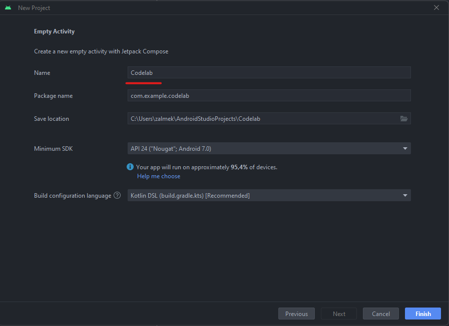

<!DOCTYPE html SYSTEM "about:legacy-compat"><html lang="en-US" data-colors-preset="contrast" data-primary-color="#307FFF"><head><meta http-equiv="Content-Type" content="text/html; charset=UTF-8"><meta charset="UTF-8"><meta name="robots" content="noindex">  <meta name="built-on" content="2023-10-19T19:52:32.649124"><meta name="build-number" content="${buildNumber}">       <title>Методические указания по выполнению задания для платформы Android | Help Instance</title><link href="https://resources.jetbrains.com/writerside/apidoc/6.1.5-b176/app.css" rel="stylesheet">   <link rel="apple-touch-icon" sizes="180x180" href="https://jetbrains.com/apple-touch-icon.png"><link rel="icon" type="image/png" sizes="32x32" href="https://jetbrains.com/favicon-32x32.png"><link rel="icon" type="image/png" sizes="16x16" href="https://jetbrains.com/favicon-16x16.png"><link rel="manifest" href="https://jetbrains.com/site.webmanifest"><link rel="mask-icon" href="https://jetbrains.com/safari-pinned-tab.svg" color="#000000"><meta name="msapplication-TileColor" content="#000000"/><meta name="msapplication-TileImage" content="https://resources.jetbrains.com/storage/ui/favicons/mstile-144x144.png"/><meta name="msapplication-square70x70logo" content="https://resources.jetbrains.com/storage/ui/favicons/mstile-70x70.png"/><meta name="msapplication-square150x150logo" content="https://resources.jetbrains.com/storage/ui/favicons/mstile-150x150.png"/><meta name="msapplication-wide310x150logo" content="https://resources.jetbrains.com/storage/ui/favicons/mstile-310x150.png"/><meta name="msapplication-square310x310logo" content="https://resources.jetbrains.com/storage/ui/favicons/mstile-310x310.png"/>  <meta name="image" content=""><!-- Open Graph --><meta property="og:title" content="Методические указания по выполнению задания для платформы Android | Help Instance"/><meta property="og:description" content=""/><meta property="og:image" content=""/><meta property="og:site_name" content="Help Instance Help"/><meta property="og:type" content="website"/><meta property="og:locale" content="en_US"/><meta property="og:url" content="tutorial.html"/><!-- End Open Graph --><!-- Twitter Card --><meta name="twitter:card" content="summary_large_image"><meta name="twitter:site" content=""><meta name="twitter:title" content="Методические указания по выполнению задания для платформы Android | Help Instance"><meta name="twitter:description" content=""><meta name="twitter:creator" content=""><meta name="twitter:image:src" content=""><!-- End Twitter Card --><!-- Schema.org WebPage --><!-- End Schema.org --><!-- Schema.org WebSite --><!-- End Schema.org --> <!-- Mermaid light/dark themes -->  <link rel="stylesheet" type="text/css" href="mermaid.css">  </head>     <body data-id="Tutorial" data-main-title="Методические указания по выполнению задания для платформы Android" data-article-props="{&quot;seeAlsoStyle&quot;:&quot;links&quot;}"  data-template="article"  data-breadcrumbs=""  >   
<main class="panel _main"><header class="panel__header">
<h3>Help Instance  Help</h3>

</header><section class="panel__content">
<article class="article" data-shortcut-switcher="inactive"><h1 data-toc="Tutorial"  id="Tutorial.md"  >Методические указания по выполнению задания для платформы Android</h1>  <section class="chapter"><h2 id="36073ec8_14089" data-toc="36073ec8_14089">План</h2><ol class="list _decimal" id="36073ec8_14090"  type="1"  ><li class="list__item" id="36073ec8_14091">
Создание проекта
</li><li class="list__item" id="36073ec8_14092">
Структура проекта
</li><li class="list__item" id="36073ec8_14093">
Добавление зависимостей
</li></ol></section><section class="chapter"><h2 id="36073ec8_14094" data-toc="36073ec8_14094">Создание проекта</h2>
Создаем новый проект в <code class="code" id="36073ec8_14096">Android Studio</code>. В качестве шаблона выбираем <code class="code" id="36073ec8_14097">Empty Activity</code>. <figure  id="36073ec8_14098"></figure>

Далее выбираем имя для проекта и нажимае на кнопку finish<figure  id="36073ec8_14102"></figure>

Затем необходимо некоторое время подождать, когда все необходимые файлы для работы приложения будут созданы, а все необход имые зависимости будут загружены.
</section><section class="chapter"><h2 id="36073ec8_14104" data-toc="36073ec8_14104">Структура проекта</h2><figure  id="36073ec8_14105"></figure>
Проект для <code class="code" id="36073ec8_14107">Android</code> имеет следующую структуру:
<ul class="list _ul" id="36073ec8_14108"    ><li class="list__item" id="36073ec8_14109">
Папка <code class="code" id="36073ec8_14110">manifests</code>
</li><li class="list__item" id="36073ec8_14111">
Папка <code class="code" id="36073ec8_14112">java</code>
</li><li class="list__item" id="36073ec8_14113">
Папка <code class="code" id="36073ec8_14114">res</code>
</li><li class="list__item" id="36073ec8_14115">
<code class="code" id="36073ec8_14116">Gradle Scripts</code>
</li></ul>
В папке <code class="code" id="36073ec8_14118">manifests</code> описываются файлы-манифесты, они декларируют особенности Android приложения.

В этих файлах описываются основные компоненты, которые будут использованы в приложении (всего их 4 - <code class="code" id="36073ec8_14121">Activity</code>, <code class="code" id="36073ec8_14122">Service</code>, <code class="code" id="36073ec8_14123">BroadcastReceiver</code>, <code class="code" id="36073ec8_14124">ContentProvider</code>), запрашиваемые приложением разрешения (например, доступ в Интернет), а также некоторые другие особенности работы приложения.

Манифест может быть только один для конкретной сборки.
<aside class="prompt" data-type="note" data-title="" id="36073ec8_14128">
Важно

Некоторые, потенциально опасные разрешения, можно получить, только в процессе работы приложения, они называются <code class="code" id="36073ec8_14132">Runtime Permissions</code>
</aside>
В папке <code class="code" id="36073ec8_14134">Java</code>, находятся 3 пакета, два из них предназначены для тестирования приложения, а в третьем будет описано само приложение, логика его работы, а также пользовательский интерфейс.

В папке <code class="code" id="36073ec8_14137">res</code>, находятся различные статические файлы - текст для компонентов, изображения, шрифты, вёрстка статичных компонентов (актуально для приложений на <code class="code" id="36073ec8_14139">view</code>).

<code class="code" id="36073ec8_14141">Gradle Scripts</code> - данная секция предназначена для работы системы автоматической сборки <code class="code" id="36073ec8_14143">Gradle</code>.

Здесь мы можем описывать какие нам необходимы зависимости для нашего приложения, и в частности для нашего модуля, это позволяет построить многомодульное приложение, с конкретными разделениями зависимостей для работы каждого модуля.
</section><section class="chapter"><h2 id="36073ec8_14146" data-toc="36073ec8_14146">Добавление зависимостей</h2>
Добавим в файл <code class="code" id="36073ec8_14148">build.gradle.kts(:app)</code> следующие зависимости:
<ul class="list _ul" id="36073ec8_14149"    ><li class="list__item" id="36073ec8_14150">
<code class="code" id="36073ec8_14151">implementation (&quot;com.squareup.retrofit2:retrofit:2.9.0&quot;)</code>
</li><li class="list__item" id="36073ec8_14152">
<code class="code" id="36073ec8_14153">implementation (&quot;com.squareup.retrofit2:converter-gson:2.9.0&quot;)</code>
</li><li class="list__item" id="36073ec8_14154">
<code class="code" id="36073ec8_14155">implementation(&quot;io.coil-kt:coil-compose:2.4.0&quot;)</code>
</li><li class="list__item" id="36073ec8_14156">
<code class="code" id="36073ec8_14157">implementation (&quot;androidx.lifecycle:lifecycle-viewmodel-compose:2.6.2&quot;)</code>
<figure  id="36073ec8_14158"></figure></li></ul>
Нажмём кнопку <code class="code" id="36073ec8_14160">Sync Now</code>, чтобы загрузить добавленные зависимости.
</section><section class="chapter"><h2 id="what-you-ve-learned" data-toc="what-you-ve-learned">What you've learned</h2>
Summarize what the reader achieved by completing this tutorial.
</section>
 Last modified: 19 октября 2023

  <a class="navigation-links__prev" href="default-topic.html">This is the first topic</a>   <a class="navigation-links__next" href="reference.html">Reference</a>  
</article>

</section></main>
  </body></html>
